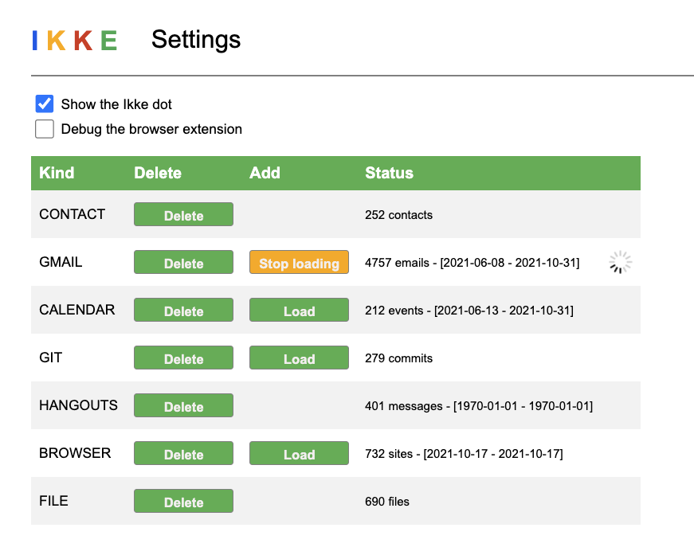

# Ikke
Easily find back all your data!

# Features

Ikke produces a local backup of all your data, with fast local search,
visualizing the connections between de data across various sources.

Why the name Ikke?

    Ikke is a Dutch colloquial/slang word, meaning "I", "Me", or "Myself".  It is pronounced as "ik-kuh", and is mainly used in the Dutch pseudo-narcist phrase "Ikke, ikke, ikke, en de rest kan stikken", translated roughly into "Me, me, me, and screw all others".

When [pronounced correctly](https://upload.wikimedia.org/wikipedia/commons/3/39/Nl-ikke.ogg),
Ikke sounds a lot like the English word "ticket", if you remove the leading and trailing t's.

# Architecture

Ikke consists of various components:
 * Importers for data sources such as browser history, local downloads, gmail, git, etc.
 * A Chrome browser extension that:
   * collects a thumbnail image of websites you visited to find them back quickly.
   * shows related items to the current "Essence" of the site being viewed, see the yellow Dot in web pages.
 * A statusbar icon showing the number of related items with a menu.
 * A super-fast freetext search backend that runs on your local machine, not needing any cloud access.
 * Smooth graph visualizations that show relationships between various data sources.
 * A [Settings UI](http://localhost:1964/settings) to control the index and indicate if you want to use the Dot or not.
 
# Installation

Setup Ikke:
 * Clone the repo and cd to its root
 * Optional: use a virtualenv
 * Run "python3 setup.py install"
 * Visit "chrome://extensions" in your browser
 * Load the unpacked extension from the repo's "extension" folder.

# Usage

Run Ikke:
 * Run "python3 main.py"

The first time Ikke runs, It needs to:
 * Get your approval to import your Google sources, such as gmail, calendar, etc.
   * The "Ikke graph" app is not verified by Google, so you may get a scary warning
   * The resulting token for this is stored on your local machine under ~/IKKE
   * The "Ikke graph" app can only access your data using that token, so only on your local machine. The token and all your indexed data is stored locally only. No one will have access to it, unless they run a program on your local machine.
   * You will get an email from Google saying "Ikke Graph was granted access to your Google Account"
 * Start elasticSearch. This takes a while.
   * Currently, access to the locally running elasticsearch instance is not using authentication. So other applications running on your local machine may get access to the indexed information.

Manage your settings:
* Click on the statusbar number icon or see [Settings](http://localhost:1964/settings).

* By default, Ikke will index your browser history.
* To load other sources, such as gmail, hit the corresponding "Load" button. 
* Optional: Enable the browser extension's "Dot".
* Click on the IKKE logo to start a new search on the currently indexed data.

# Uninstall

Uninstall takes three steps:
* Visit [Settings](http://localhost:1964/settings) and delete all data.
* Remove ~/IKKE entirely
* Remove the local repo you cloned during startup

# Future Work

Some things that could improve Ikke:
* Add authentication to elasticsearch
* Add an ML model to the Essence finder
* Finish up the py2app bundling (see build.py)
* Distribute as a Mac app in the AppStore with a real installer
* Handle possible port number conflicts
* Add more importers, such as TikTok, FB, IG, and WhatsApp...
* Consider extensions for other browsers, such as IE, Firefox
* Add a plugin to standalone tools, such as VSCode.

# Privacy

You privacy is key. Ikke does not upload ANY data. Everything being indexed is stored on your local machine. Ikke does not use your data for marketing purposes or ads. No logging is ever uploaded. Your data is yours and stays yours.
